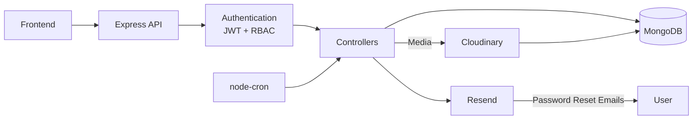

# 🌊 Gram Dhara


A **full-stack Rural Water Infrastructure O&M platform** built with **Node.js, Express, and MongoDB**.
This project connects citizens directly to the departments responsible for fixing civic problems - water leaks, broken infrastructure, anything worth flagging - and reinforces strong backend design patterns like **role-based access control, audit logging, and background automation**.

<br> 🔧 This project was built for **Smart India Hackathon 2025 🏆** by **Team Vajra Dev**. <br><br>
      🌐 Try it out at [gram-dhara.vercel.app](https://gram-dhara.vercel.app) <br> &nbsp; 

---

## 📌 Features

- 🔐 **Login / Signup** system with JWT-based authentication
- 🧑‍🤝‍🧑 **Three user roles**:
  - `Citizen` 
  - `Department Admin`
  - `Super Admin` 
- 📸 **Report submission**:
  - Photo upload (required)
  - Voice recording (optional)
  - Location tagging
- 🧾 **Complaint Lifecycle**:
  - Pending → In Progress → Resolved / Rejected
- 📜 **Report History** (Full audit trail of every status change)
- ⏰ **Automatic Reminders** (hourly cron job flags reports idle 48+ hours)
- 🔔 **Notifications** (in-app notifications)
- 📊 **Analytics Dashboard** (totals, pending vs. resolved, department load)
- 📢 **Notices** (publish and archive public announcements)
- 🗃️ **Cloudinary-backed media storage** - secure URLs live in MongoDB
- 📚 📚 Implements **role-based access control, audit logging, and scheduled background automation**
- 🔁 **Retrying report submissions** - failed uploads retry automatically with exponential backoff
- 🗺️ **Interactive map-based location picker** for tagging a report's location
- 📈 **Live analytics regeneration** - dashboard numbers recompute after every report change

---

## 🔄 Architecture

This project follows a modular, layered design to keep the request path easy to trace and the codebase easy to extend. Here's a breakdown of how each layer collaborates:

---

### 🖥️ `frontend/dashboard/`
> 🧭 Role-based dashboard layer

- One dashboard per role - `user/`, `admin/`, `department-admin/` - all calling the backend through a shared API client.

---

### 🚏 `backend/src/routes/`
> 🗺️ REST endpoint definitions

- One router per resource: `report`, `user`, `department`, `category`, `notice`, `notification`, `analytic`, `reportAssignment`, `reportHistory`, `admin`, `superAdmin`.
- All mounted onto the single Express app in `app.js` under `/api/v1/*`.
- Delegates every request straight to a controller - routes stay thin.

---

### 🧠 `backend/src/controllers/`
> 💼 Where most of the application's engineering actually lives

- Handles **report submission, assignment, and status transitions.**
- Manages **user authentication, role checks, and department/category management.**
- Coordinates everything a report touches on its way through the system: **uploading media to Cloudinary, writing the `ReportHistory` audit entry, regenerating analytics, and firing notifications** - all from the same request.
- Calls Mongoose models directly to **load/save data** - no separate service tier for the common path.

---

### 💾 `backend/src/models/`
> 🗂️ Mongoose schema definitions

- `Report`, `User`, `Department`, `Category`, `Notice`, `Notification`, `ReportAssignment`, `ReportHistory`, `Analytics`.
- Stores data in MongoDB collections, one per model.

---

### 🛠️ `backend/src/utils/`
> ⚙️ Shared service helpers

- `cloudinary.js` - uploads report photos/voice notes, returns a secure URL.
- `notification.service.js` - powers the hourly reminder job and in-app notifications.
- `analytics.service.js` - regenerates dashboard summary numbers after every report change.
- `sendEmail.js` - sends reminder and password-reset emails via Resend.

---

### 🧱 Layered Architecture & Data Flow



Everything funnels through one Express app instead of separate services - there's no message queue or internal API to keep in sync. For a platform this size, that keeps the request path traceable end-to-end and avoids the overhead of coordinating deployments across services.

---

## 🏗️ Project Structure

```
gram-dhara/
├── backend/
│   └── src/
│       ├── routes/            ←   REST endpoint definitions
│       ├── controllers/       ←   Business logic
│       ├── models/            ←   Mongoose schemas
│       ├── middlewares/       ←   Auth & upload validation
│       ├── utils/             ←   Shared services
│       ├── db/                ←   MongoDB connection
│       ├── app.js             # Express app + route mounting
│       └── index.js           # Entry point; schedules node-cron
│
└── frontend/
    └── dashboard/
        ├── user/              # Citizen dashboard
        ├── admin/             # Super admin dashboard
        └── department-admin/  # Department admin dashboard
```
---

## 🧠 Engineering Decisions

A few choices that shaped how this was built, and why:

- 📜 **`ReportHistory` is append-only, not a status field that gets overwritten.**<br>Every transition (`pending → in_progress → resolved/rejected`) writes a new entry instead of mutating the report in place, so the full history of a complaint is always reconstructable - not just its current state.
- 🗃️ **Media lives in Cloudinary, MongoDB only stores the secure URL.**<br>Photos and voice recordings never touch the database directly, which keeps report documents small and queries fast regardless of upload volume.
- 🧭 **`Report.status` and `ReportAssignment.status` are tracked separately.**<br>A report can be pending before it's even assigned, and an assignment can be completed independently of the report's own lifecycle - collapsing both into one field would lose that distinction.
- ⏰ **Reminders run on `node-cron`, not on request.**<br>An hourly job scans for reports idle 48+ hours and fires a notification regardless of whether anyone is using the app that hour - reminders shouldn't depend on user activity to exist.
- 🔁 **Report submission retries with exponential backoff.**<br>Uploads and network calls fail; a failed submission attempt is retried automatically instead of forcing the citizen to resubmit from scratch.
- 🔑 **Every model uses an application-generated UUID as its logical key, not Mongo's `_id`.**<br>That keeps references (`reportId`, `userId`, etc.) stable and readable across collections instead of depending on Mongo's internal identifiers.

---

## 🔐 Auth & Roles

**JWT-based, no external auth provider.**

- 🎟️ Access + refresh tokens issued on login
- 🧑‍🤝‍🧑 Role (`citizen`, `department_admin`, `super_admin`) is baked into the token
- 🛡️ Role checks happen in middleware, before the controller runs
- ⏳ The frontend checks for an expired token before rendering a success screen, so a stale session doesn't show a citizen a report as "submitted" when the request never actually landed
- 🔄 Refresh tokens let a user stay logged in without the server keeping any session state to track

This approach was chosen to keep:

- 🚪 One login flow for three roles, instead of three separate systems
- 📡 Stateless request handling - no session store to keep in sync
- 🧱 A clean place (middleware) to enforce "who can hit which route"

---

## 📚 Concepts Demonstrated

- ✅ **Role-Based Access Control** - one JWT, three permission levels
- ✅ **Audit Logging** - `ReportHistory` never overwrites, only appends
- ✅ **Background Automation** - `node-cron` drives reminders independent of requests
- ✅ **Separation of Concerns** - clean `routes` / `controllers` / `models` / `utils` layers
- ✅ **External Storage Offloading** - Cloudinary for media, MongoDB stays lightweight
- ✅ **Stateless Auth** - JWT access + refresh tokens, no session store

---

## ✨ Highlights

- 🧾 A complete complaint lifecycle - submission, assignment, resolution, all logged end to end
- 📜 An immutable audit trail - `ReportHistory` never overwrites, only appends
- 🔁 Reliable submissions - failed requests retry with exponential backoff instead of silently failing
- 📦 Lightweight database - media never touches MongoDB directly
- ⏰ Real scheduled automation - reminders fire hourly, independent of user activity
- 🔒 Role-secured dashboards for three distinct user types
- 🌍 Deployed and live at [gram-dhara.vercel.app](https://gram-dhara.vercel.app)

---

## 🧠 Inspiration & Credits

- Built with 💧 by **Team Vajra Dev** for **Smart India Hackathon 2025 🏆**
- Fueled by 💪 Determination and 🧠 Curiosity.

---

## 📜 License

No license has been applied to this repository.
